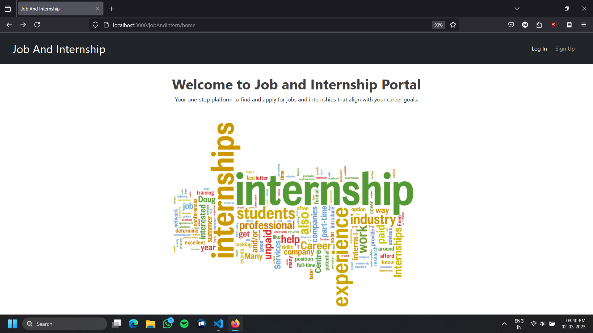
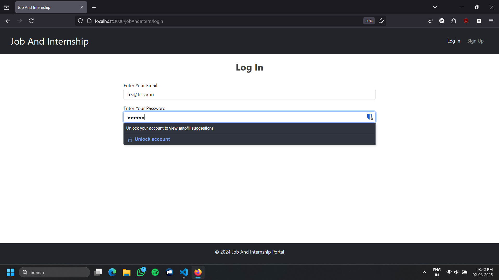
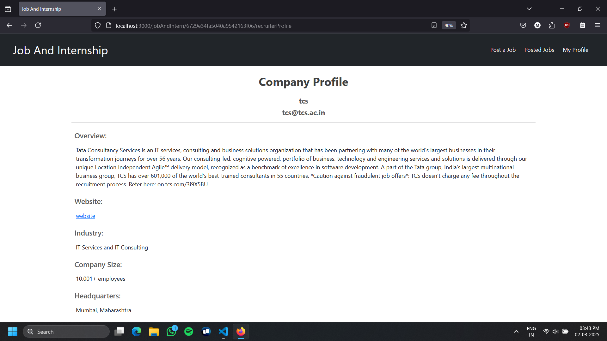
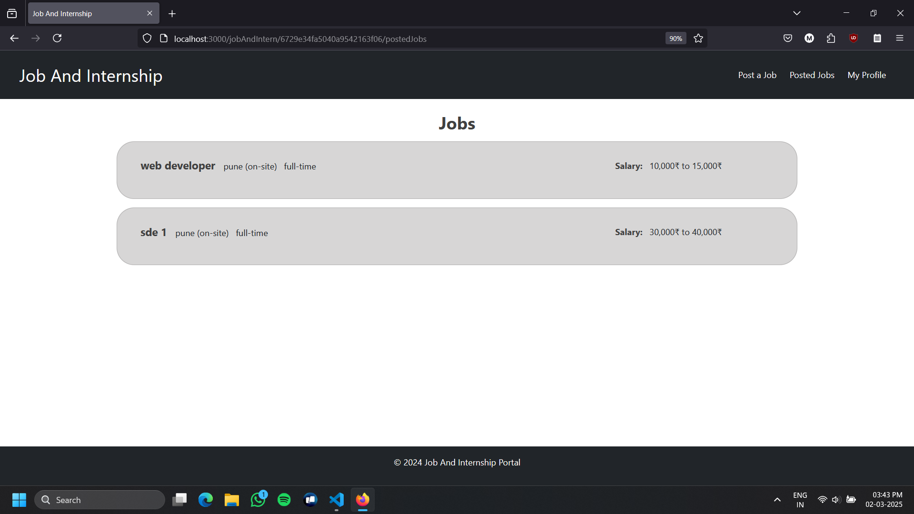
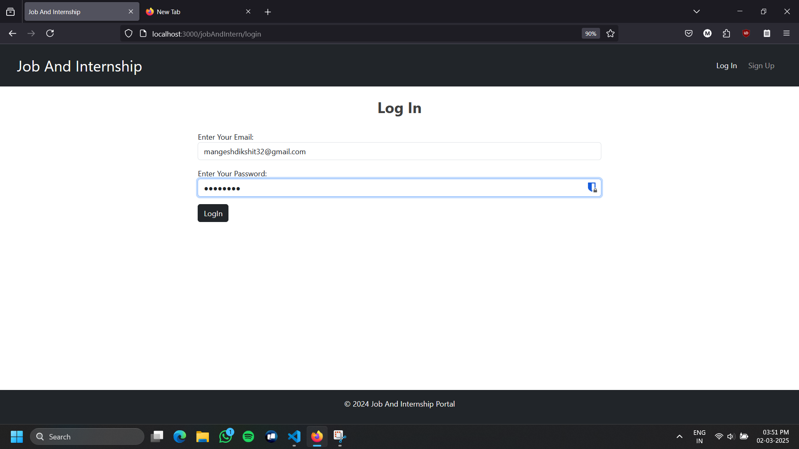

# Job and Internship Portal

This is a web application designed to connect job seekers with recruiters. The platform allows job seekers to browse job opportunities, apply for positions, and manage their profiles. Recruiters can post job listings, view candidate profiles, and communicate with applicants.

## Features

- **Job Seekers** can:
  - Register and create a personal profile
  - Browse and search for job listings
  - Apply for jobs
  - Update their profiles

- **Recruiters** can:
  - Post job listings
  - View applications and candidate profiles
  - Manage job listings
  - Communicate with applicants

## ScreenShots

- **Home Page**

- **Recruiter LogIn**

- **Recruiter Profile**

- **Recruiter's Posted Jobs**

- **List of Applied Candidates**
<video src="screenshots/vid3.mp4" controls>
</video>
<!--  -->

- **Post A Job**
<video src="screenshots/vid1.mp4" controls>
</video>
<!--  -->

- **Candidate Login**

- **Candidate Profile**
<video src="screenshots/vid2.mp4" controls>
</video>
<!--  -->

- **Candidate Apply for Job**
<video src="screenshots/vid4.mp4" controls>
</video>
<!--  -->

## Technologies Used

- **Backend**: Node.js, Express
- **Frontend**: EJS, Bootstrap
- **Database**: MongoDB (for data storage)

